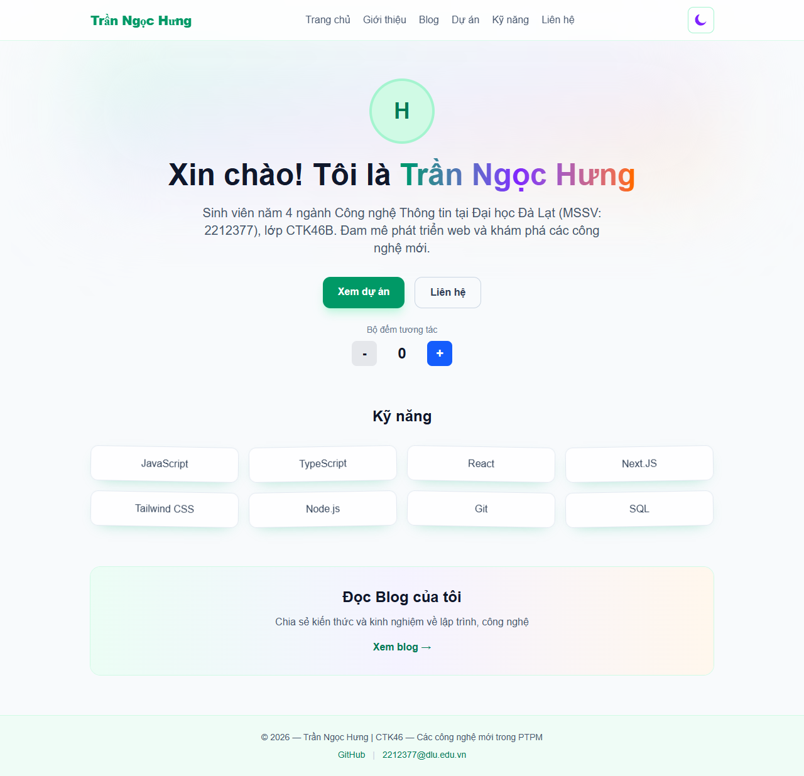
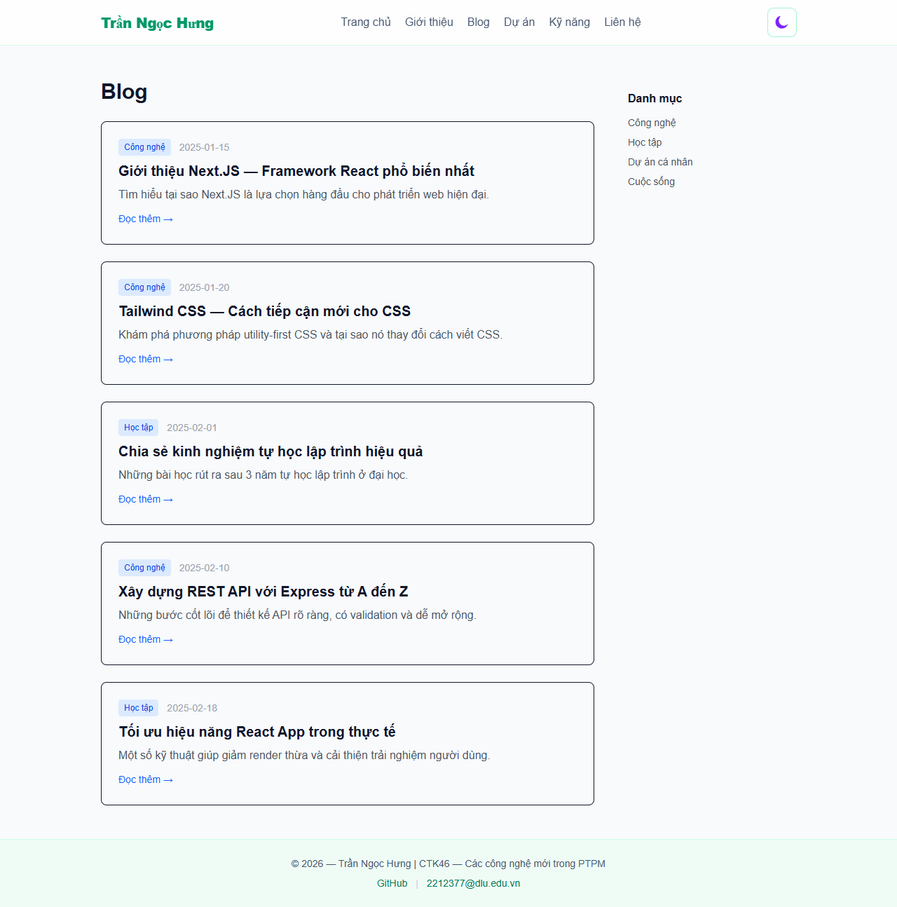
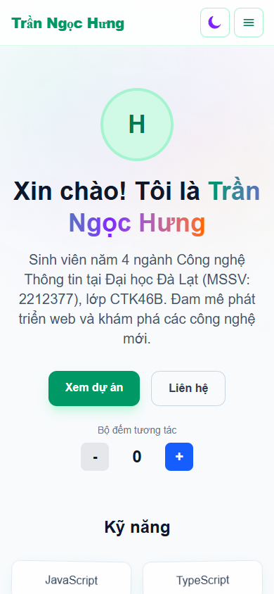

# Lab 2 - Next.js App Router va Client Components

## Thong tin

- Ho ten: Tran Ngoc Hung
- Lop: CTK46B
- MSSV: 2212377
- Mon: Cac cong nghe moi trong phat trien phan mem

## Muc tieu Lab 2

- Xay dung website portfolio/blog voi Next.js App Router.
- Ap dung Tailwind CSS cho giao dien responsive.
- Su dung Server Component va Client Component dung ngu canh.
- Thuc hanh voi "use client" va quan sat loi khi dat sai boundary.

## Noi dung da thuc hien

1. Giao dien va dieu huong
- Navbar responsive co hamburger menu tren mobile.
- Chuyen doi mau sac theo huong emerald/violet/orange.
- Ho tro dark mode bang class-based dark variant.

2. Trang chu va blog
- Trang chu co Hero, Skills, CTA, Counter tuong tac.
- Trang blog co danh sach bai viet va trang chi tiet bai viet.
- Cuoi bai viet co LikeButton de tang/giam luot thich.

3. Client Components trong bai
- Counter: src/components/counter.tsx
- LikeButton: src/components/like-button.tsx
- ThemeToggle: src/components/theme-toggle.tsx
- CopyButton: src/components/copy-button.tsx

4. Bai thuc hanh loi "use client"
- Da thu bo "use client" trong Counter de tai hien loi build.
- Loi xuat hien do useState chi duoc phep trong Client Component.
- Sau do da them lai "use client" de build pass.

## Cong nghe su dung

- Next.js 16 (App Router)
- React 19
- TypeScript
- Tailwind CSS v4
- ESLint

## Huong dan chay du an

```bash
npm install
npm run dev
```

Mo trinh duyet tai http://localhost:3000

## Kiem tra chat luong

```bash
npm run lint
npm run build
```

## Tai lieu tham khao cho Lab 2

- Client Components: https://nextjs.org/docs/app/building-your-application/rendering/client-components
- use client directive: https://nextjs.org/docs/app/api-reference/directives/use-client

## Hinh anh minh hoa

### 1) Trang chu (Desktop)



### 2) Trang Blog (Desktop)



### 3) Trang chu (Mobile viewport)



## Ghi chu

- Runtime chinh dang su dung thu muc app/.
- Thu muc src/app duoc dong bo de phuc vu yeu cau bai tap.
